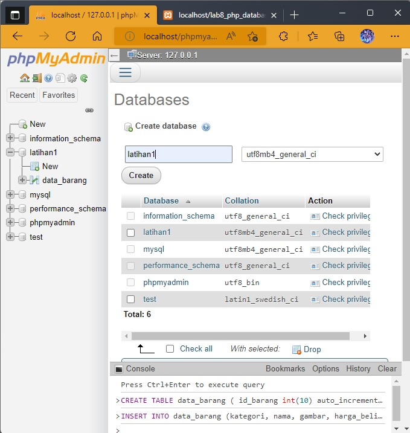
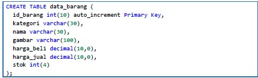
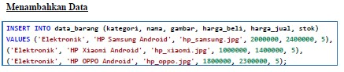
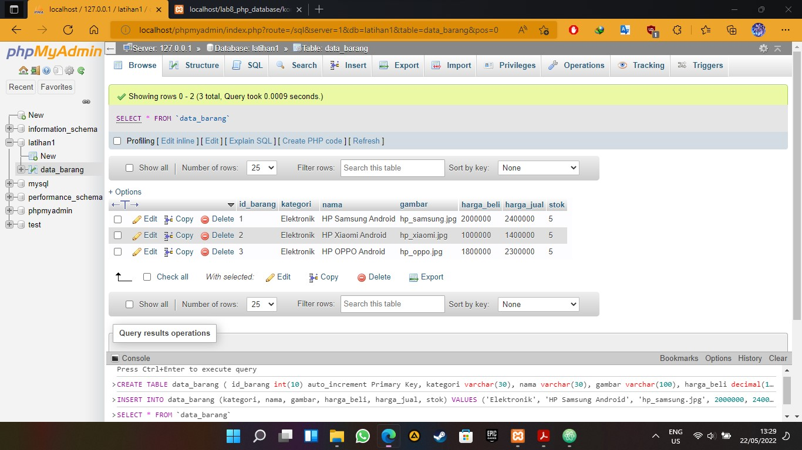
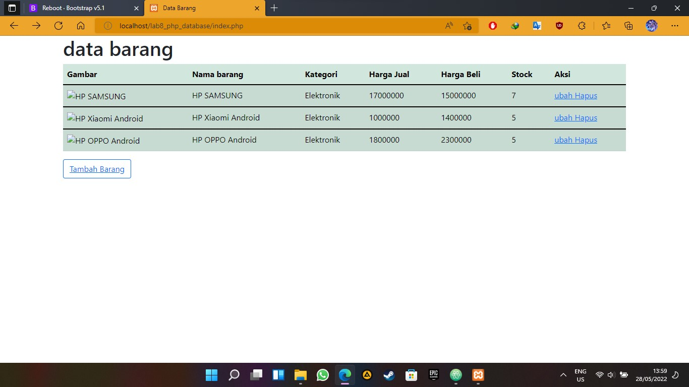
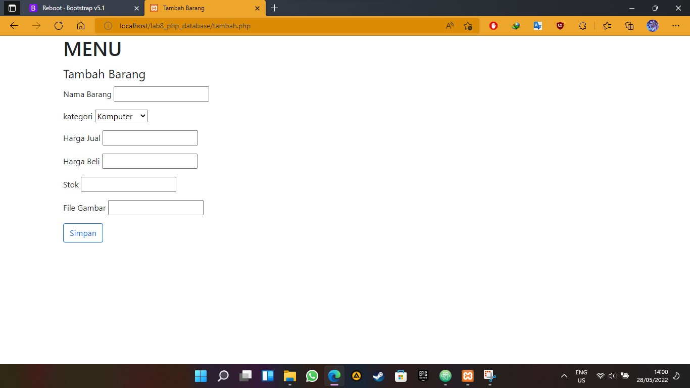
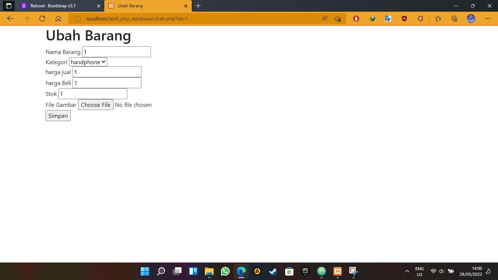
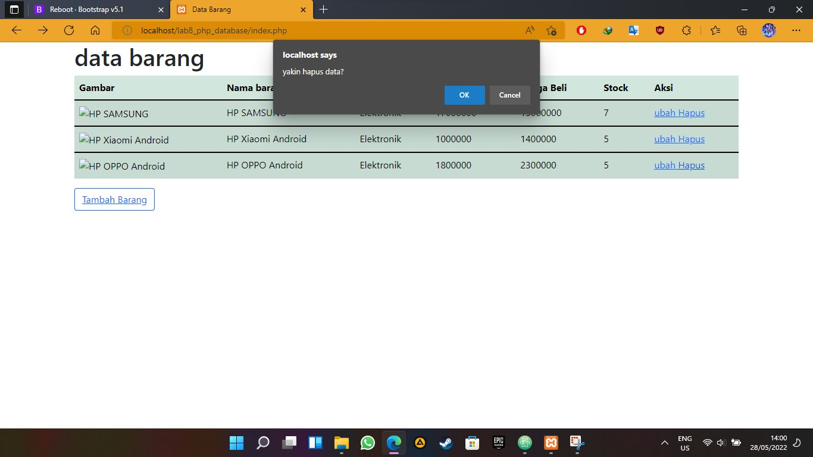

#lab8_web
# bagus tri handono - 312010170
# 20.TI.B1
============================================================= 
membuat membuat program CRUD sederhana menggunakan PHP. 
1.buat database di mysql seperti Gambar dibawah ini 
 
2.buat tambel data barang seperti gambar dibawah ini 
 
3.coba tambah kan data melalui console kedalam table tersebut 
 
4.jika berhasil maka akan terlihat seperti tampilan dibawah ini 
 
5.buat file [koneksi.php](code/koneksi.php) untuk menyambungkan file php dengan database 
6.buat [tabel barang](code/index.php)untuk menampilkan database ke bentuk html 
 
7.buat menu [tambah barang](code/tambah.php) untuk menambah tabel barang 
 
7.buat menu [ubah barang](code/ubah.php) untuk mengubah isi tabel barang 
 
7.buat menu [Hapus barang](code/tambah.php) untuk menghapus tabel barang 
 
